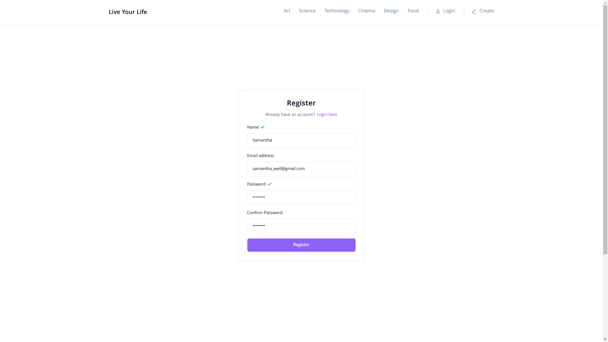
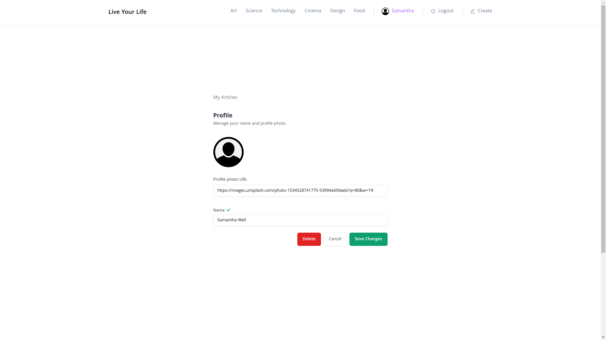
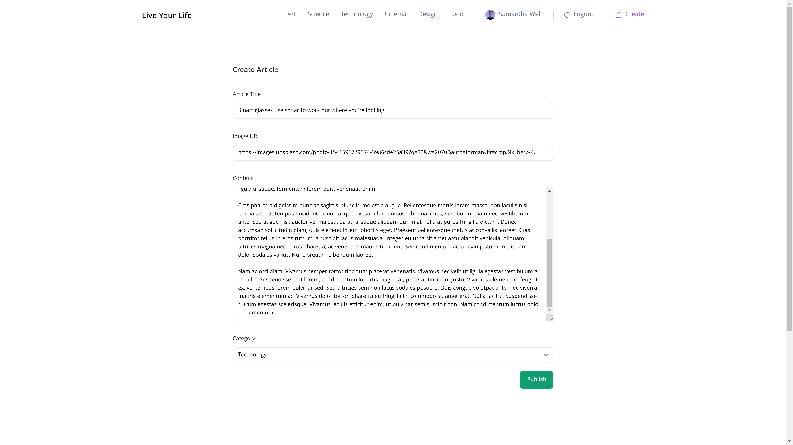
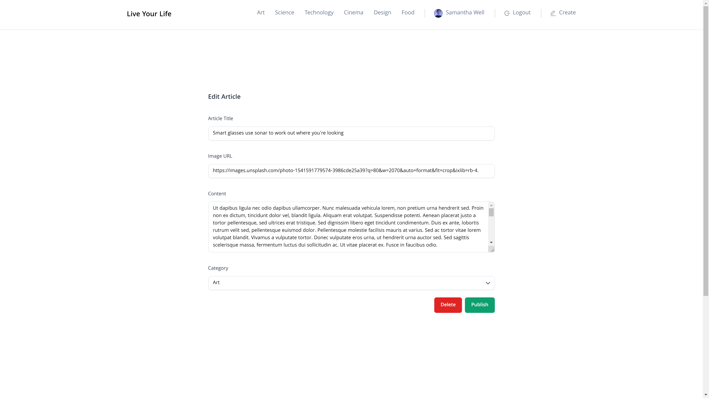
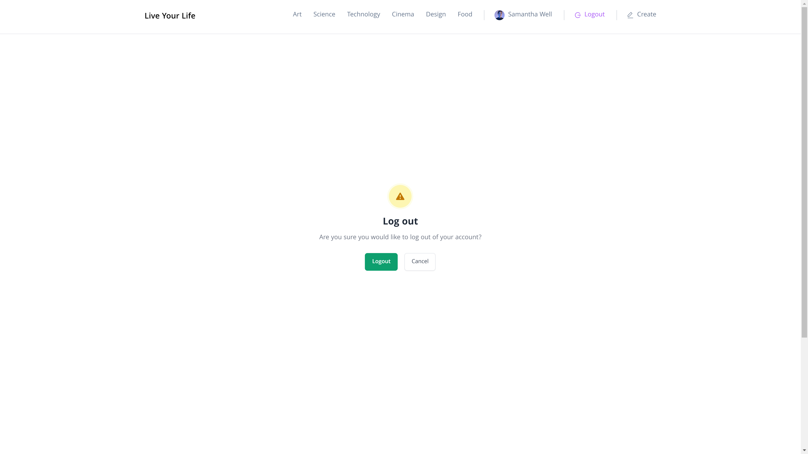

# Full-Stack Blog App Using React, Node.js, Express, and PostgreSQL

> [!IMPORTANT]
> The app is **currently in production** on [Vercel](https://vercel.com). Feel free to **experience** the app **firsthand** by following the link: [Live Your Life](https://live-your-life.vercel.app/).

> [!WARNING]  
> **All users and articles** displayed on this website are created solely **for demonstration purposes and are NOT real**. Any resemblance to actual persons, living or dead, or real articles is purely coincidental. The content is generated to showcase the functionality of the website and doesn't represent real user data or articles. 

> [!NOTE]
> This repository consists of **solely the frontend part of the application**. If you'd like to check out the **backend** code, you can follow the link: [Blog App Server](https://github.com/elizaveta-sm/blog-app-server).

<!-- TABLE OF CONTENTS -->

  
Table of Contents

  <ol>
    <li>
      <a href="#about-the-project">About the Project</a>
      <ul>
        <li><a href="#key-features-include">Key Features Include</a></li>
        <li><a href="#built-with">Built With</a></li>
        <li><a href="#deployed-with">Deployed With</a></li>
      </ul>
    </li>
    <li><a href="#usage">Usage</a></li>
    <li><a href="#acknowledgments">Acknowledgments</a></li>
  </ol>

<!-- ABOUT THE PROJECT -->
## About the Project

Live Your Life is a full-stack blog application that leverages principles of **responsive and accessible web design**. **Made from scratch**, the app was intented to be a **learning tool** for me to gain hands-on experience and acquire new skills and knowldge in the process of its developement. 

&nbsp;

### Key Features Include

:star: **Read and Sort Articles**: Explore a wide range of articles by the website's users and sort them by 6 distinct categories.  

:star: **Join Live Your Life**: Create a personalized account. 

:star: **Publish, Edit & Delete Articles**: Write compelling articles and share them with the world. Enjoy complete control over your content with options to edit and delete articles as needed. 

Check <a href="#usage">Usage</a></li> for detailed information. 

&nbsp;

### Built With

:star: **Frontend**
* HTML, CSS, JavaScript 
* [![React][React.js]](https://react.dev/)
* [![Vite][Vite.js]](https://vitejs.dev/)
* [![Tailwind][TailwindCSS]](https://tailwindcss.com/)
* [![Redux][Redux-Toolkit.js]](https://redux-toolkit.js.org/)

:star: **Backend**
* JavaScript, SQL
* [![Node][Node.js]](https://nodejs.org/en)
* [![Postgres][PostgreSQL]](https://www.postgresql.org/)
* [![Express][Express.js]](https://expressjs.com/)

&nbsp;

### Deployed With

:star: **Frontend and Server**
* [![Vercel][Vercel.com]](https://vercel.com/)

:star: **Database**
* [![Supabase][Supabase.com]](https://supabase.com/)

Check <a href="#acknowledgments">Acknowledgments</a></li> for more information.

<!-- USAGE -->
## Usage

 ### Register Page

- Fill in the required fields with your credentials:
- User name
- Email address
- Password

### Login Page

- Enter your email address and password to log in.

### Main Page

- You are redirected to the main page of the app after successful login.
- A notification appears in the bottom right corner confirming successful login.
- Your user name and default profile picture are displayed in the navigation bar.

### Profile Settings Page

- Click on your username in the navigation bar to access your profile settings.
- Here, you can:
>- Change your profile picture by pasting the image URL.
>- Update your username.
>- Delete your profile entirely.

### Create Article Page

- Click on the "create" tab to create a new article.
- Fill in the required fields and press 'publish' to create the article.

### View Created Article on the Main Page

- After successfully creating the article, you can view it among articles written by other users.

### Edit/Delete Article Page

- Click on the article you want to edit or delete.
- The fields are filled with the article's information.
- You can make changes or use the delete button to remove the article.

### Logout Confirmation Page

- Confirm your decision to log out of your account.

## Acknowledgments
 
:gem: [![Preline][Preline UI]](https://preline.co/)
:gem: [![React Router][React Router DOM]](https://reactrouter.com/en/main)
:gem: [![Axios][Axios]](https://axios-http.com/)
:gem: [![React Cookie][react-cookie]](https://www.npmjs.com/package/react-cookie)
:gem: [![uuid][uuid]](https://www.npmjs.com/package/uuid)
:gem: [![Bcrypt][bcrypt]](https://www.npmjs.com/package/bcrypt)
:gem: [![JSON Web Token][jsonwebtoken]](https://www.npmjs.com/package/jsonwebtoken)
:gem: [![Postgres.js][Postgres.js]](https://github.com/porsager/postgres)
:gem: [![Nodemon][nodemon]](https://www.npmjs.com/package/nodemon)
