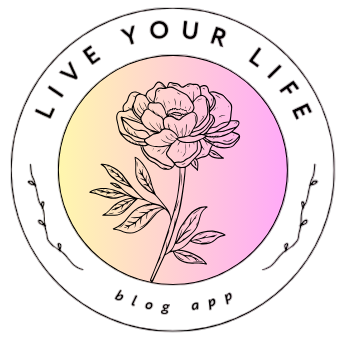
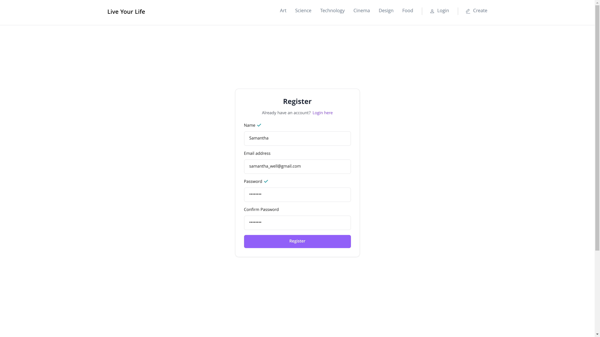
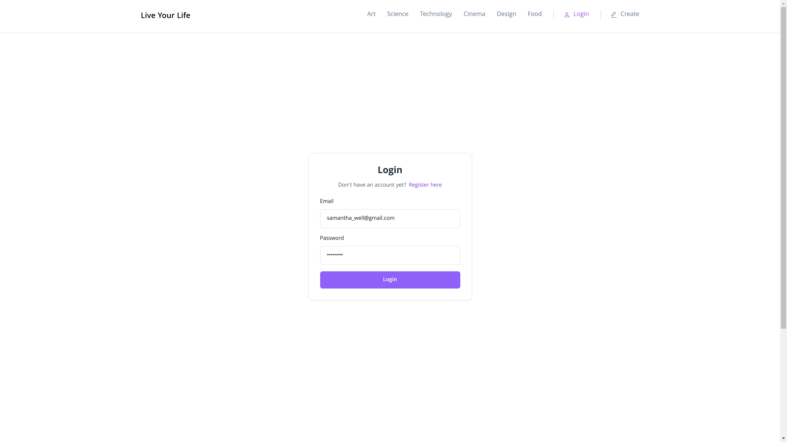
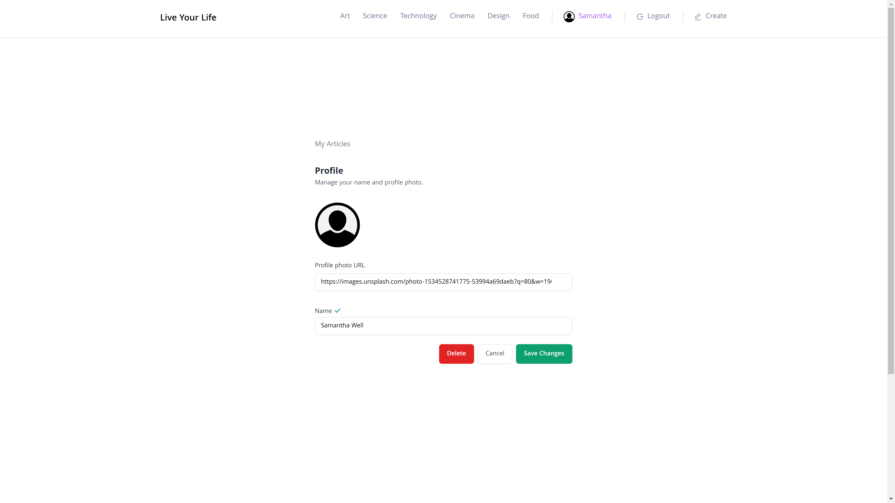
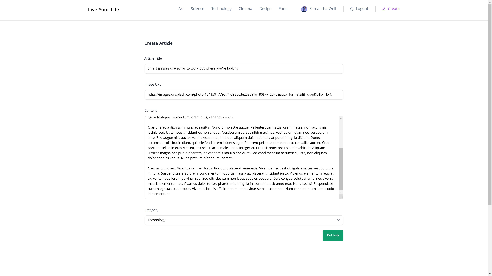
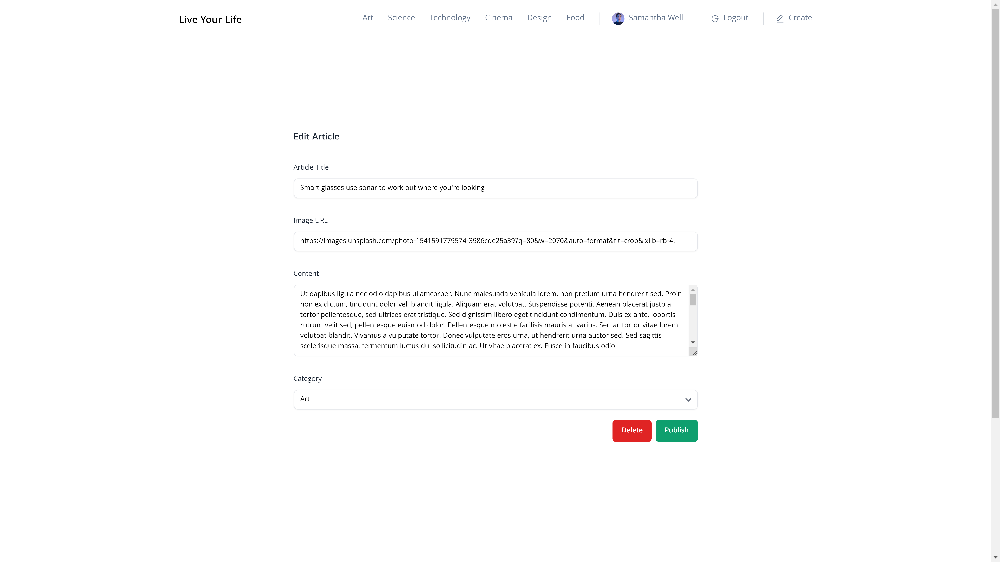
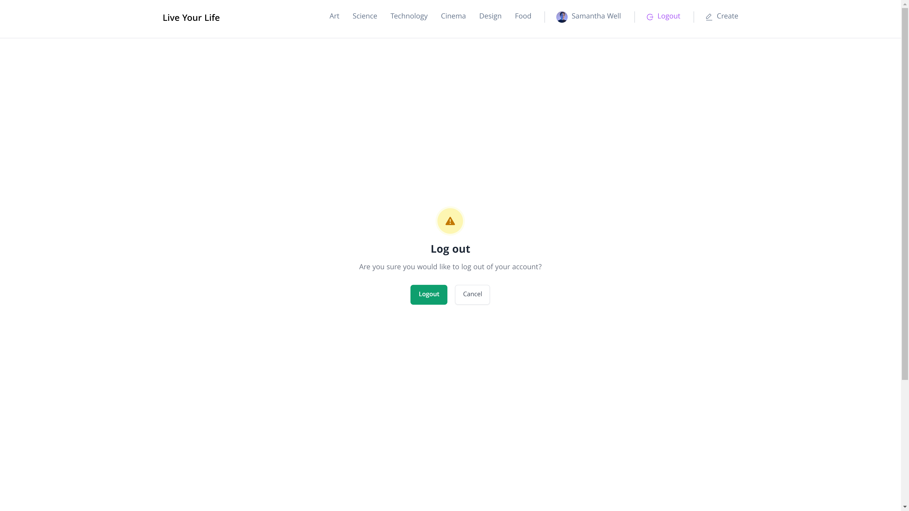

# Веб-приложение для блога полного стека с использованием React, Node.js, Express, и PostgreSQL

> [!IMPORTANT]
> Веб-приложение **выложено в интернет** с помощью [Vercel](https://vercel.com) и в настоящее время **доступно для пользователей**. **Протестируйте** приложение самостоятельно, перейдя по ссылке: [Live Your Life](https://live-your-life.vercel.app/).

> [!WARNING]  
> **Все пользователи и статьи**, отображаемые на этом веб-сайте, **созданы исключительно в демонстрационных целях и НЕ являются реальными**. Любое сходство с реальными людьми, живыми или мертвыми, или реальными статьями является совершенно случайным. Содержание создано для демонстрации функциональности веб-приложения и не представляет собой реальных пользовательских данных или статей.

> [!NOTE]
> Этот репозиторий состоит **исключительно из фронтэнда веб-приложения**. Если вы хотите посмотреть код **бэкенда**, вы можете перейти по ссылке: [Blog App Server](https://github.com/elizaveta-sm/blog-app-server).

<!-- TABLE OF CONTENTS -->

  
Содержание

  <ol>
    <li>
      <a href="#о-проекте">О проекте</a>
      <ul>
        <li><a href="#основной-функционал">Основной функционал</a></li>
        <li><a href="#создано-с-использованием">Создано с использованием</a></li>
        <li><a href="#опубликовано-с-использованием">Опубликовано с использованием</a></li>
      </ul>
    </li>
    <li><a href="#использование-веб-приложения">Использование веб-приложения</a></li>
    <li><a href="#лицензия">Лицензия</a></li>
    <li><a href="#отдельные-благодарности">Отдельные благодарности</a></li>
  </ol>

&nbsp;

<!-- ABOUT THE PROJECT -->
## О проекте

  

:small_blue_diamond: *Live Your Life* :small_blue_diamond: - это полностековое веб-приложение для блога, использующее принципы **адаптивного и доступного веб-дизайна**.  **Созданное с нуля**, приложение было задумано как **инструмент для обучения**, чтобы я могла получить практический опыт и приобрести новые знания и умения в процессе его разработки. 

&nbsp; 

### Основной функционал

:star: **Читайте и сортируйте статьи**: исследуйте широкий спектр статей пользователей сайта и сортируйте их по 6 различным категориям.

:star: **Присоединяйтесь к :small_blue_diamond: *Live Your Life* :small_blue_diamond:**: создайте персональную учетную запись.

:star: **Публикуйте, редактируйте и удаляйте статьи**: пишите увлекательные статьи и делитесь ими со всем миром. Наслаждайтесь полным контролем над своим контентом с возможностью редактирования и удаления статей по мере необходимости.

> См. <a href="#использование-веб-приложения">Использование веб-приложения</a></li> для более подробной информации.

&nbsp; 

### Создано с использованием

:star: **Фронтэнд**
* HTML, CSS, JavaScript 
* [React](https://react.dev/)
* [Vite](https://vitejs.dev/)
* [Tailwind](https://tailwindcss.com/)
* [Redux Toolkit](https://redux-toolkit.js.org/)

:star: **Бэкенд**
* JavaScript, SQL
* [Node.js](https://nodejs.org/en)
* [PostgreSQL](https://www.postgresql.org/)
* [Express.js](https://expressjs.com/)

&nbsp; 

### Опубликовано с использованием

:star: **Фронтэнд и сервер**: [Vercel](https://vercel.com/)

:star: **База данных**: [Supabase](https://supabase.com/)

> См. <a href="#отдельные-благодарности">Отдельные благодарности</a> для получения дополнительной информации.

&nbsp;

<!-- USAGE -->
## Использование веб-приложения

### :memo: Страница регистрации

- Заполните необходимые поля, указав свои учетные данные:
  - Имя пользователя
  - Адрес электронной почты
  - Пароль

---

### :memo: Страница входа

- Введите свои адрес электронной почты и пароль для входа в систему.

---

### :memo: Главная страница

- После успешного входа в систему вы будете перенаправлены на главную страницу приложения.
- В правом нижнем углу появится уведомление, подтверждающее успешный вход в систему.
- Ваше имя пользователя и дефолтовая фотография профиля отображаются на панели навигации.

---

### :memo: Страница настроек профиля

- Нажмите на свое имя пользователя в панели навигации, чтобы перейти к настройкам профиля.
- Здесь вы можете:
  - Изменить фотографию профиля, вставив URL-адрес изображения.
  - Обновить свое имя пользователя.
  - Полностью удалить свой профиль.

---

### :memo: Страница создания статьи

- Нажмите на вкладку "Create", чтобы создать новую статью.
- Заполните необходимые поля и нажмите "Publish", чтобы закончить создание статьи.

---

### :memo: Созданная статья теперь есть на главной странице

- После успешного создания статьи вы можете просмотреть ее среди статей, написанных другими пользователями.

---

### :memo: Страница редактирования/удаления статьи

- Нажмите на статью, которую вы хотите отредактировать или удалить.
- Поля заполнены информацией о статье.
- Вы можете внести изменения или воспользоваться кнопкой удаления ("Delete"), чтобы удалить статью.

---

### :memo: Страница подтверждения выхода из системы

- Подтвердите свое решение выйти из учетной записи.

&nbsp;

## Лицензия

Распространяется под лицензией MIT.
> См. <a href="https://github.com/elizaveta-sm/live-your-life/blob/main/LICENSE.md">LICENSE.md</a> для получения дополнительной информации.

&nbsp;

## Отдельные благодарности
 
:gem: [Preline](https://preline.co/)

:gem: [React Router](https://reactrouter.com/en/main)

:gem: [Axios](https://axios-http.com/)

:gem: [react-cookie](https://www.npmjs.com/package/react-cookie)

:gem: [uuid](https://www.npmjs.com/package/uuid)

:gem: [bcrypt](https://www.npmjs.com/package/bcrypt)

:gem: [jsonwebtoken](https://www.npmjs.com/package/jsonwebtoken)

:gem: [Postgres.js](https://github.com/porsager/postgres)

:gem: [nodemon](https://www.npmjs.com/package/nodemon)
